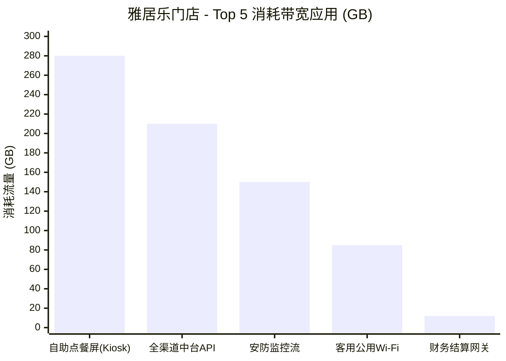
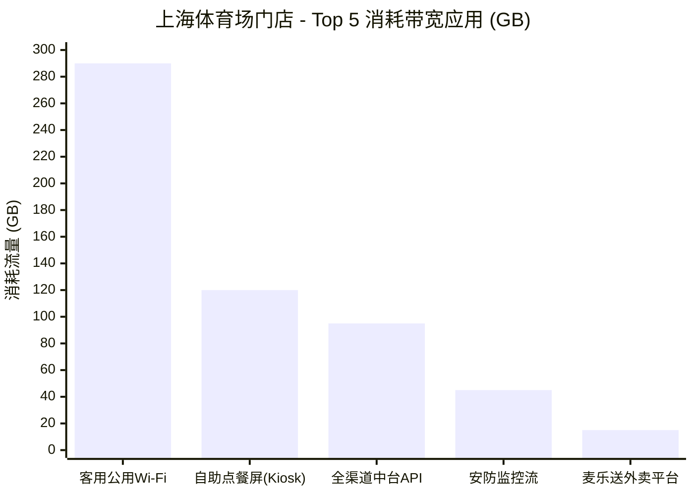

# 智能报告引擎 - 最终渲染成果演示 (Rendered Mockups)

本文档承接 Pipeline 演化推演的 `State 3 (底层编译态)`。当数据引擎 (Data Engine) 拉起底层编译好的 YAML，并从真实数据库查到数据后，最终推送给前端或以 PDF 导出的真实业务报表长什么样？

下面是针对**“麦当劳定时巡检”**和**“金拱门多门店比对”**这 2 个由对话系统自动构建的模板，跑批后产出的最终渲染效果等比模拟。

---

# 📄 报告一：每周二自动分发的设备巡检报告

**报告主题**：园区核心 IT 设施健康周报
**数据账期 (T_biz)**：2026-03-24 ~ 2026-03-31（近一周）
**报告生成时间**：2026-04-01 02:00:00 (计划外临时拉起补跑)

> 注：因为模板设定了 `derive_from: "T_biz"` 和 `snap: "week"`，即便周三来补跑，时间范围依然精准落在了上个自然周。

### 核心 IT 设备健康概况 
*(底层：由 `kv_grid` + `cols_per_row: 3` 排版引擎自动拉伸的 3 列看板)*

| 📱 数通设备 | 💻 核心服务器集群 | 📺 协作终端设备 |
| :--- | :--- | :--- |
| **平均运行温度**：34.2 ℃<br>**可用性状态**：✅ 正常 | **平均运行温度**：43.8 ℃<br>**可用性状态**：⚠️ 高温预警 | **平均运行温度**：28.5 ℃<br>**可用性状态**：✅ 正常 |
| **告警次数**：0 次 | **告警次数**：14 次 | **告警次数**：2 次 |


### 预警维护派单 (机房连续高温 > 30分钟)
*(底层：由 `simple_table` 结合 Agent 生成的 `WHERE duration > 30` 在引擎渲染的纯净数据表格)*

| 资产类别 | 设备编号 / 所在机柜 | 连续高温时长 (超限记录) | 峰值温度 | 智能运维动作 | 派单优先级 |
| :--- | :--- | :--- | :--- | :--- | :--- |
| **服务器** | `SRV-Core-SH09` (A02柜) | **45 min** | 48.2 ℃ | 已自动降频限流负载 | 🔴 高危 |
| **服务器** | `SRV-Core-SH11` (A02柜) | **38 min** | 46.9 ℃ | - | 🔴 高危 |
| **数通设备** | `SW-Agg-04` (B01柜) | **32 min** | 41.5 ℃ | 备用风扇满载切入 | 🟡 中等 |

*💡 评估说明：核心服务器集群在上周四 14:00-15:00 发生集中过热，机房温控告警已推送派单。*

---

# 📄 报告二：金拱门网络运行诊断 (多对象横向大比对)

**报告主题**：金拱门（中国）有限公司 - 门店网络状况诊断
**报告范围**：雅居乐国际广场餐厅、上海体育场餐厅
**数据账期**：近一周

> 注：底层系统因为 `foreach` 循环裂变，将同样的布局和 SQL 渲染逻辑应用在了不同的门店变量上，形成了非常连贯的横向滚动大报告。

## 📍 雅居乐国际广场餐厅
*(实例一)*

### 可靠性：网络中断与可用性概况
| 断网总次数 | 累计中断时长 | SLA 健康度 |
| :---: | :---: | :---: |
| **1 次** | **14 分钟** | 🟡 99.86% |

### 容量性能：园区出口带宽趋势图
*(底层：`chart` 组件设为 `line`)*
```mermaid
xychart-beta
    title "雅居乐门店 - 出口带宽占用走势 (Mbps)"
    x-axis "周一" --> "周日"
    y-axis "带宽 (Mbps)" 0 --> 1000
    line [120, 240, 890, 850, 180, 520, 410]
```
*(图表解读：周三、周四中午存在明显的点餐高并发引起的下发带宽挤兑高峰)*

### 应用质量：TopN 业务流量应用排名
*(底层：`chart` 组件设为 `bar`。Agent 知道排行最适合用条形或柱状图呈现)*


---

## 📍 上海体育场餐厅
*(实例二：无缝承接上面的模板结构)*

### 可靠性：网络中断与可用性概况
| 断网总次数 | 累计中断时长 | SLA 健康度 |
| :---: | :---: | :---: |
| **0 次** | **0 分钟** | 🟢 100.00% |

### 容量性能：园区出口带宽趋势图
```mermaid
xychart-beta
    title "上海体育场门店 - 出口带宽占用走势 (Mbps)"
    x-axis "周一" --> "周日"
    y-axis "带宽 (Mbps)" 0 --> 500
    line [110, 115, 120, 130, 480, 450, 120]
```
*(图表解读：该门店属于赛事驱动型峰值。周五、周六因球赛产生海量流量潮汐，其余时段极低)*

### 应用质量：TopN 业务流量应用排名

*(图表解读：由于赛事聚集，球迷在店连接 Wi-Fi 时长激增，成为带宽消耗榜首。)*

---
🚀 **大纲与排版的高度解耦带来的红利总结**：
你看，业务高管只说了一句话：“把网络中断、带宽、topN排名的报告发我”。
大模型通过大纲把它拆分开来并分配到了：`kv_grid`(数字大屏) $\to$ `chart:line`(趋势曲线) $\to$ `chart:bar`(条形排行)。在这个渲染结果里表现得极其有呼吸感和结构美！没有任何冗余的地方。
